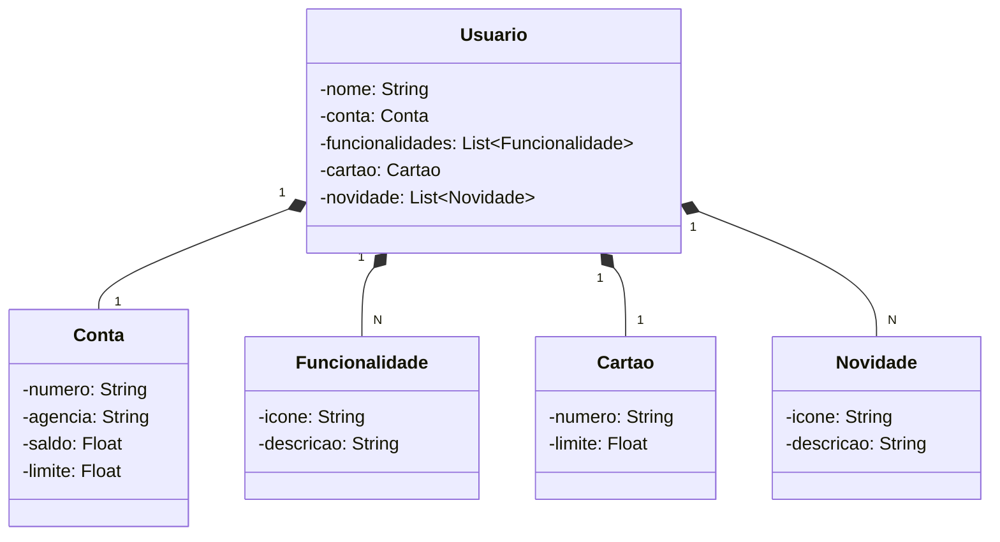

# Projeto API 2
Java RESTful API projeto 2

## Diagrama de Classes

```mermaid
classDiagram
    class Usuario {
        -nome: String
        -conta: Conta
        -funcionalidades: List~Funcionalidade~
        -cartao: Cartao
        -novidade: List~Novidade~
    }

    class Conta {
        -numero: String
        -agencia: String
        -saldo: Float
        -limite: Float
    }

    class Funcionalidade {
        -icone: String
        -descricao: String
    }

    class Cartao {
        -numero: String
        -limite: Float
    }

    class Novidade {
        -icone: String
        -descricao: String
    }

    Usuario "1" *-- "1"Conta
    Usuario "1" *-- "N" Funcionalidade
    Usuario "1" *-- "1" Cartao
    Usuario "1" *-- "N" Novidade

```
